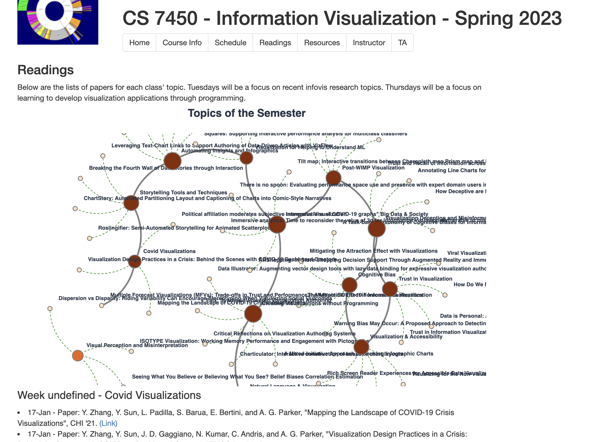

## Background
This repository is a restyling of an existing website for CS 7450 and a sandbox for trying out ideas using D3.js.

## Demo

https://cynthialmy.github.io/course-website-design/

 

## Reference
This project is based on the template from [richardadalton](http://richardadalton.github.io/). No installation is required. To work with the charts offline simply open index.html in a browser.